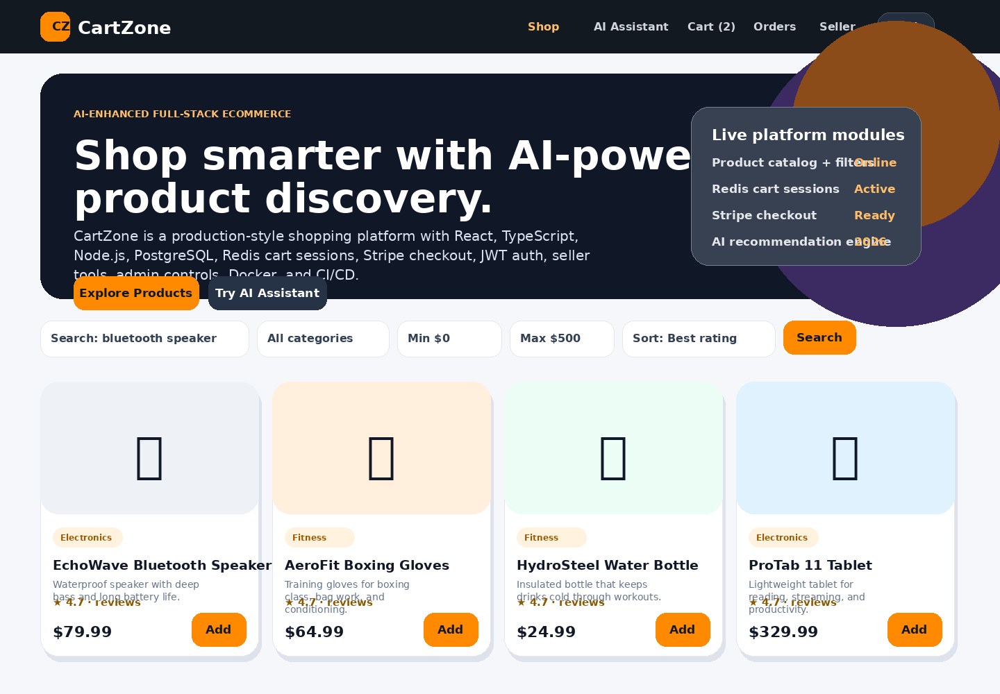
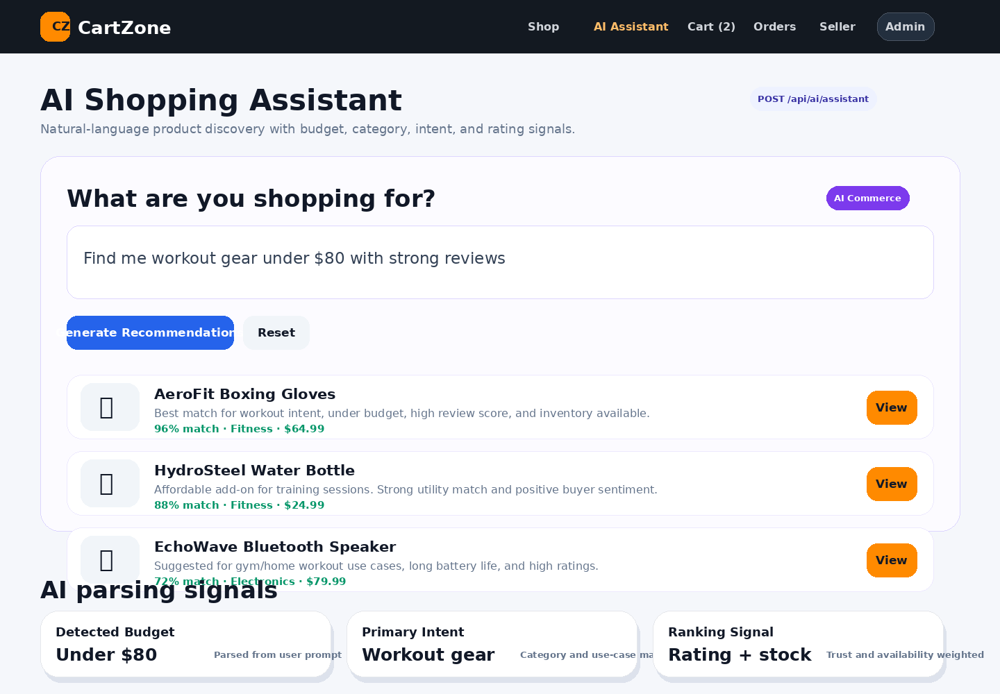
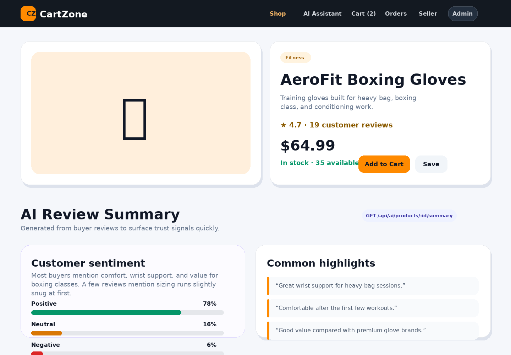
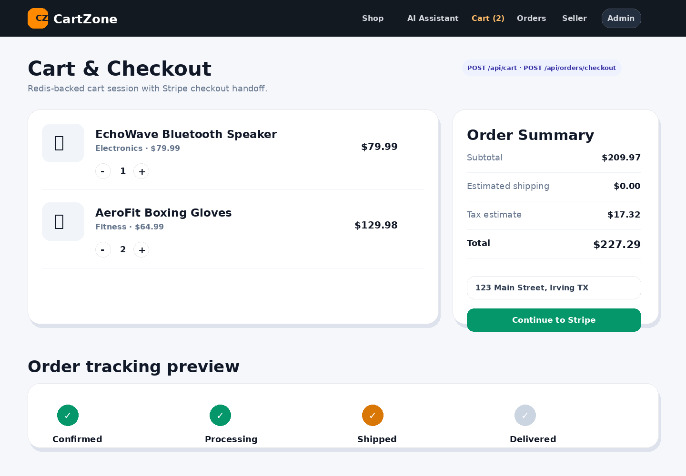
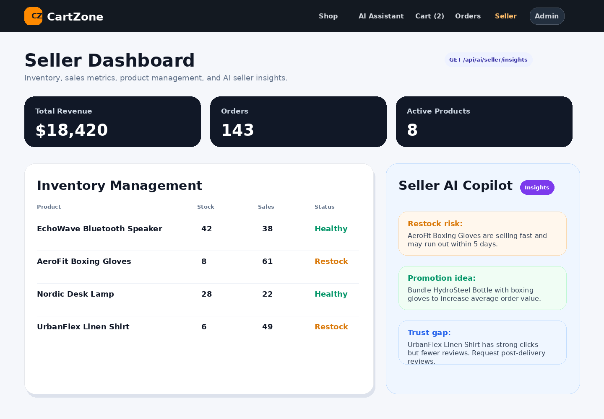
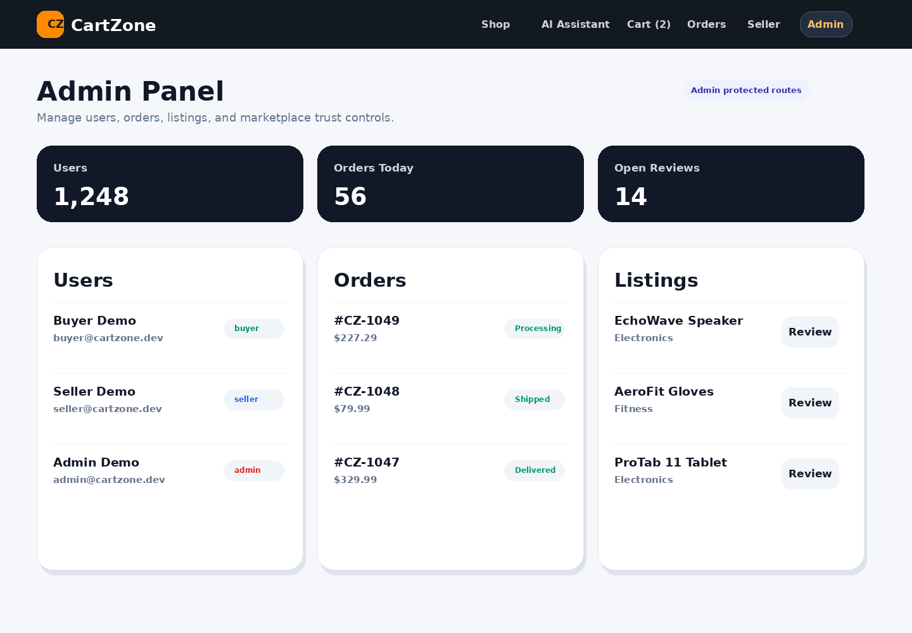

# 🛍️ CartZone — Full Stack Shopping Platform

CartZone is a professional full-stack shopping platform inspired by Amazon-style workflows: product catalog, Redis-backed cart, Stripe checkout, order tracking, seller dashboard, product reviews, admin panel, JWT authentication, PostgreSQL persistence, Docker, CI, automated tests, and an AI shopping layer for 2026-era product discovery.

This project is designed to be clean enough for GitHub, LinkedIn, and recruiter conversations.

## What it demonstrates

- **Frontend:** React, TypeScript, Redux Toolkit, React Router, professional responsive UI
- **Backend:** Node.js, Express, TypeScript, REST API architecture
- **Database:** PostgreSQL for users, products, orders, reviews, refresh tokens
- **Caching/session layer:** Redis-backed shopping cart that survives refresh
- **Payments:** Stripe Checkout session + webhook route with demo fallback when Stripe keys are not configured
- **Auth:** JWT access token + refresh token rotation + email verification flow
- **Seller dashboard:** Product creation, inventory updates, sales summary
- **Admin panel:** User, product, and order management
- **DevOps:** Docker Compose, Dockerfiles, GitHub Actions CI
- **Testing:** Jest + Supertest coverage for health route, token logic, cart logic, and order totals
- **Cloud-ready:** AWS S3 presigned upload URL support for product images
- **AI commerce layer:** Natural-language shopping assistant, intent extraction, budget-aware recommendations, AI review summaries, and seller merchandising insights

## Screens you get

- Home/product catalog with search, category filter, price filter, sorting, and AI shopping assistant
- Product details page with reviews, star ratings, and AI-generated review summary
- Cart page powered by Redis backend
- Checkout page with Stripe/demo checkout
- Order history and live order status stream
- Seller dashboard for inventory, sales, and AI merchandising recommendations
- Admin panel for users, products, and orders
- Login/register/email verification flow

## AI-era features added

CartZone now includes an AI commerce layer that makes the project feel more current than a basic CRUD shopping app:

- **AI Shopping Assistant:** Users can type prompts like “find me workout gear under $80” or “I need a tech gift with strong ratings.”
- **Intent extraction:** Backend extracts category, budget, keywords, and use-case signals from natural language.
- **Budget-aware product ranking:** Recommendations are ranked using category match, keyword relevance, rating, inventory availability, and price fit.
- **AI review summaries:** Product pages generate buyer-friendly summaries from customer reviews with sentiment and common highlights.
- **Seller AI Copilot:** Seller dashboard surfaces restock alerts, trust/review gaps, best-seller promotion ideas, and inventory risks.
- **No paid AI key required:** The current implementation uses a deterministic local AI-style ranking engine so recruiters can run it immediately. It is structured so you can later swap the service with OpenAI, Bedrock, Gemini, or another LLM provider.

## Project structure

```txt
cartzone/
  backend/              Express + TypeScript API
  frontend/             React + TypeScript client
  docker-compose.yml    PostgreSQL + Redis + API + frontend
  .github/workflows/    CI pipeline
  docs/                 API contract, LinkedIn description, screenshots guide
```


## One-command dependency install without Docker

CartZone is a Node.js project, so the installable dependency files are:

- `backend/package.json`
- `frontend/package.json`

I also included helper files for Windows setup:

- `requirements.txt` — system requirements and install notes
- `install-dependencies.bat` — easiest Windows installer script
- `scripts/install-dependencies.ps1` — PowerShell installer script
- root `package.json` — monorepo helper commands

From the project root, run one of these:

```powershell
.\install-dependencies.bat
```

or:

```powershell
powershell -ExecutionPolicy Bypass -File scripts/install-dependencies.ps1
```

or, if Node/npm already work:

```powershell
npm run install:all
```

Then edit `backend/.env`, create the PostgreSQL `cartzone` database, and run:

```powershell
npm run db:migrate
npm run db:seed
```

Start the backend:

```powershell
npm run dev:backend
```

Start the frontend in a second terminal:

```powershell
npm run dev:frontend
```

## Quick start with Docker

```bash
cp backend/.env.example backend/.env
cp frontend/.env.example frontend/.env

docker compose up --build
```

Then open:

- Frontend: http://localhost:5173
- Backend health: http://localhost:4000/health
- API docs: `docs/API.md`

The backend automatically runs migrations and seeds demo data when the API container starts.

## Demo accounts

After Docker starts, use these accounts:

| Role | Email | Password |
|---|---|---|
| Buyer | buyer@cartzone.dev | Password123! |
| Seller | seller@cartzone.dev | Password123! |
| Admin | admin@cartzone.dev | Password123! |

## Run locally without Docker

If Docker is not installed, use the Windows no-Docker guide:

```txt
docs/NO_DOCKER_SETUP.md
```

For quick local development, CartZone supports Redis memory mode:

```env
REDIS_MODE=memory
```

That lets you run the app with Node.js + PostgreSQL first. The production-style Redis implementation is still included and can be enabled later with `REDIS_MODE=redis`.

### Backend

```bash
cd backend
cp .env.no-docker.example .env
npm install
npm run db:migrate
npm run db:seed
npm run dev
```

### Frontend

```bash
cd frontend
cp .env.example .env
npm install
npm run dev
```

## Stripe setup

CartZone works without Stripe keys by returning a demo checkout URL.

For real Stripe Checkout:

1. Create a Stripe account.
2. Add keys to `backend/.env`:

```env
STRIPE_SECRET_KEY=sk_test_...
STRIPE_WEBHOOK_SECRET=whsec_...
FRONTEND_URL=http://localhost:5173
```

3. Forward webhooks locally:

```bash
stripe listen --forward-to localhost:4000/api/orders/webhook
```

Webhook event handled:

```txt
checkout.session.completed
```

## AWS S3 image upload setup

Product image upload supports S3 presigned URLs. Add these to `backend/.env`:

```env
AWS_REGION=us-east-1
AWS_S3_BUCKET=your-product-image-bucket
AWS_ACCESS_KEY_ID=...
AWS_SECRET_ACCESS_KEY=...
```

Route:

```txt
POST /api/upload/product-image-url
```

## Tests

```bash
cd backend
npm test
```

Tests included:

- `health.test.ts` — Supertest API health check
- `auth.service.test.ts` — token signing behavior
- `cart.service.test.ts` — cart total/quantity logic
- `order.service.test.ts` — order total calculation

## GitHub setup

```bash
git init
git add .
git commit -m "Initial commit: CartZone full-stack shopping platform"
git branch -M main
git remote add origin https://github.com/YOUR_USERNAME/cartzone.git
git push -u origin main
```

## LinkedIn project summary

Use this in your LinkedIn Projects section:

> Built CartZone, a full-stack AI-enhanced shopping platform with React, TypeScript, Redux Toolkit, Node.js, Express, PostgreSQL, Redis, Stripe, Docker, and GitHub Actions. Implemented natural-language product discovery, budget-aware AI recommendations, AI review summaries, seller AI insights, product search/filtering, Redis-backed cart persistence, JWT auth with refresh token rotation, Stripe checkout and webhooks, order tracking, seller inventory dashboard, admin management, automated Jest/Supertest tests, and AWS S3-ready product image uploads.

## Portfolio talking points

- “I used Redis for cart persistence so guests/users do not lose cart state after refresh.”
- “I modeled orders, order items, inventory, reviews, roles, and refresh-token rotation in PostgreSQL.”
- “Stripe checkout is production-shaped with webhook handling, but the app also has a local demo fallback.”
- “Seller and admin flows show real-world role-based access control.”
- “The AI layer extracts buyer intent and ranks product recommendations without requiring paid API keys for local demos.”
- “Seller AI insights turn inventory, sales, and review data into actionable merchandising recommendations.”
- “Docker Compose lets recruiters run the whole app with one command.”

## Notes

This is a reference project. For production, add rate limiting, request logging with trace IDs, stricter CSP, real email provider integration, image validation, observability, and deployment-specific secrets management.


## Application Screenshots

### Home Page


### AI Shopping Assistant


### Product Details and AI Review Summary


### Cart and Checkout


### Seller Dashboard and AI Copilot


### Admin Panel


